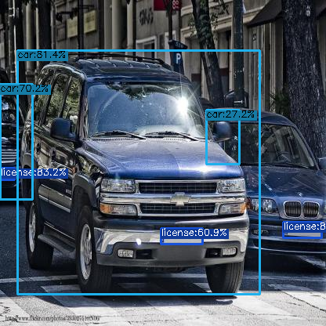
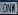

# License Plate Detection
This repository aims to detect the text on the license plate. First, detect the car and license plate by using YOLOX. Then, extract the text from the license plate using vedastr which is an open source scene text recognition toolbox based on PyTorch.

| Original                   | Detection by YOLOX                      | OCR detection                    |
| ---------------------------| -----------------------------------------| -----------------------------------|
|                            | | <p float='left'>&nbsp;&nbsp;&nbsp;&nbsp;&nbsp;&nbsp;</p>|

## Install License Plate Detection

### 1. Create venv environment and activate it.
```
python3 -m venv env
source env/bin/activate
```
### 2. Clone the repository.
```
git clone git@github.com:eiphyumoe47/licenseplate_detection.git
cd licenseplate_detection
```

### 3. Install pytorch and dependencies.
```
pip3 install torch torchvision
pip3 install -r requirements.txt
```
## Inference
```
python3 src/detect.py --path ../../test_video.mp4 --config configs/detect.yaml --name yolox-s --output licenseplate_detection/result
```
You can modify the configurations as you wish.
