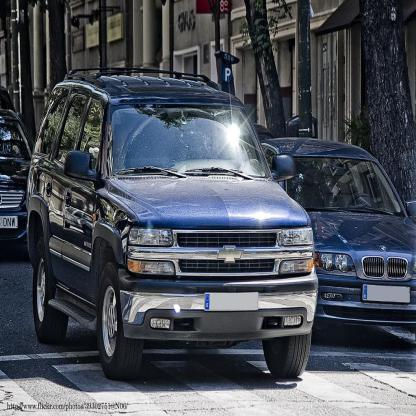

# License Plate Detection
This repository aims to detect the text on the license plate. First, detect the car and license plate by using YOLOX. Then, extract the text from the license plate using vedastr which is an open source scene text recognition toolbox based on PyTorch.

| Original                   | Detection by YOLOX                      | OCR detection                    |
| ---------------------------| -----------------------------------------| -----------------------------------|
|                            | | <p float='left'>&nbsp;&nbsp;&nbsp;&nbsp;&nbsp;&nbsp;</p>|

## Install License Plate Detection

### 1. Create venv environment and activate it.
```
python3 -m venv env
source env/bin/activate
```
### 2. Clone the repository.
```
git clone git@github.com:eiphyumoe47/licenseplate_detection.git
cd licenseplate_detection
```

### 3. Install pytorch and dependencies.
```
pip3 install -r requirements.txt
```

### 4. Download YOLOX models weight files.

|Model      | Weights       |
|-----------|---------------|
|Yolox-s    | [gdrive](https://drive.google.com/file/d/1KT0iE67gWCXBUDfHL7gcc8xhvhDk7gBO/view?usp=sharing)|
|Yolox-l    | [gdrive](https://drive.google.com/file/d/1XxtFK2RI4y3DEPnPO-xiV9ZtSqrJ4yRn/view?usp=sharing)|

These two models are the best ckpt model files which are trained based on the pretrained yolox-s and yolox-l model from [this repo](https://github.com/Megvii-BaseDetection/YOLOX).

*Note: Yolox-s has been used in this project. Create folder `YOLOX_outputs/yolox-s`.Move Yolox weight files under `src/YOLOX/yolox/YOLOX_outputs/yolox-s/`.*

### 5. Download the Pretrained OCR model file.
|Model      | Weights       |IIIT5k_300     |Case-sensitive|
|-----------|---------------|---------------|--------------|
|ResNet-CTC |[github](https://drive.google.com/file/d/1gtTcc5kpVs_s5a6OR7eBh431Otk_-NrE/view?usp=sharing)|87.97|False|
|ResNet-FC  |[github](https://drive.google.com/file/d/1OnUGdv9RFhFbQGXUUkWMcxUZg0mPV0kK/view?usp=sharing)|88.80|False|
|TPS-ResNet-BiLSTM-Attention|[github](https://drive.google.com/file/d/1YUOAU7xcrrsAtEqEGtI5ZD7eryP7Zr04/view?usp=sharing)|90.93|False|
|Small-satrn| [github](https://drive.google.com/file/d/1bcKtEcYGIOehgPfGi_TqPkvrm6rjOUKR/view)|91.97|False|

The tabel shows the accuracy on the test IIIT5k_300 dataset. Small-satrn model has been used in this project.</br></br>
*Note: Create checkpoint folder and move downloaded file to `checkpoint/`.*

## Inference

```
python3 src/detect.py --path ../../test_video.mp4 --config configs/detect.yaml --name yolox-s --output licenseplate_detection/result
```
You can modify the configurations as you wish.
